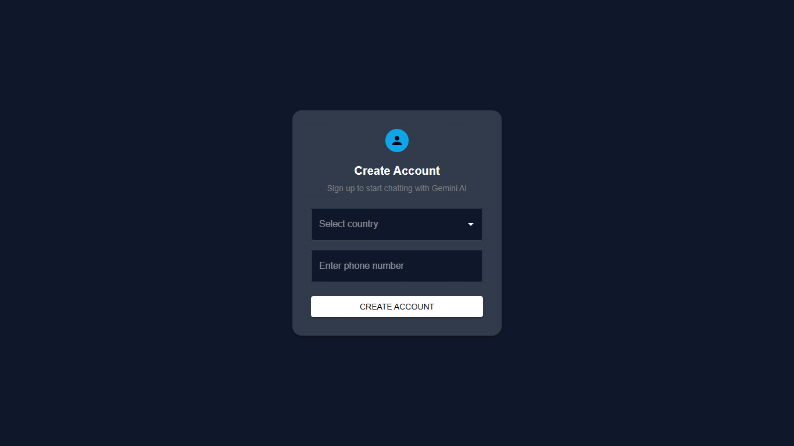
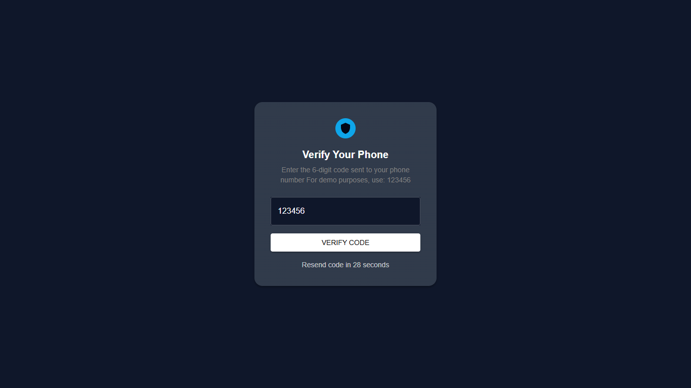
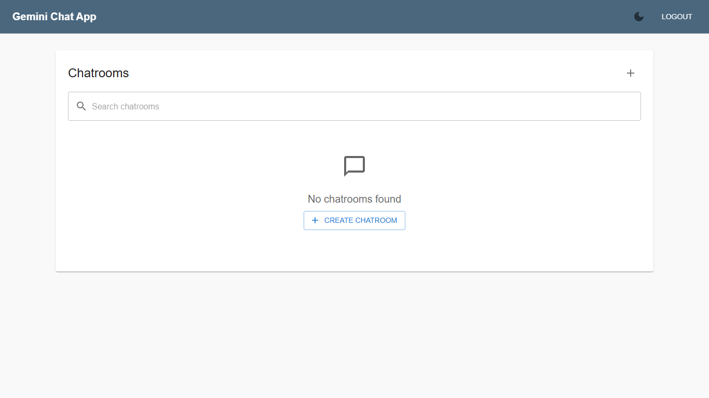
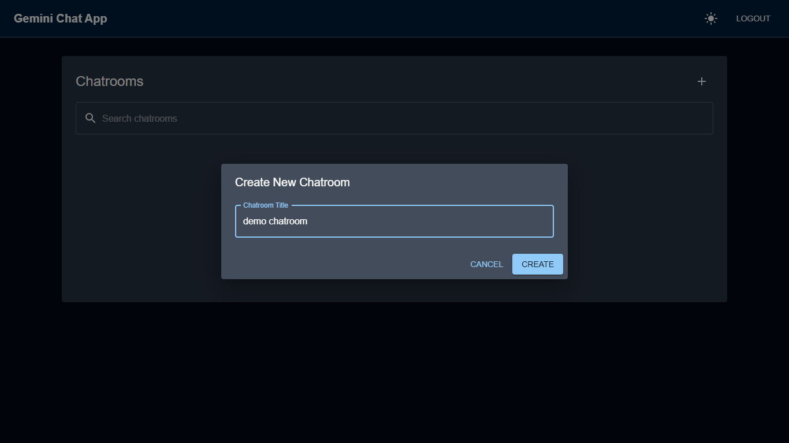
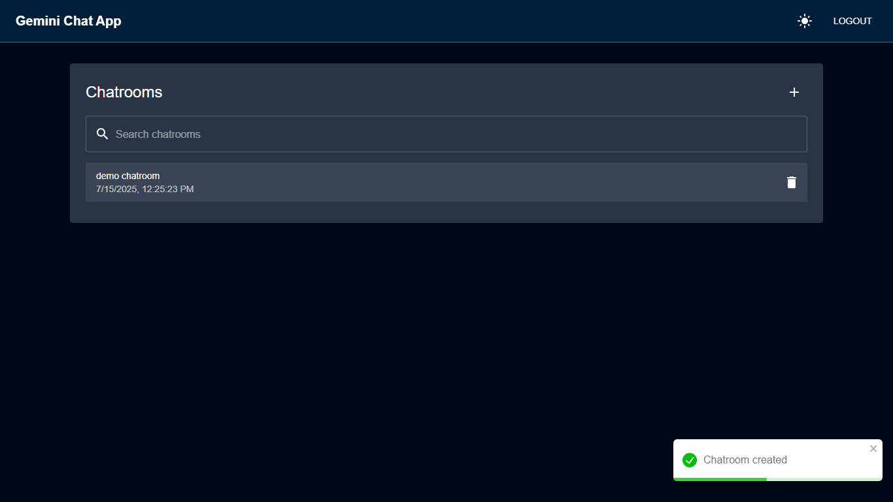
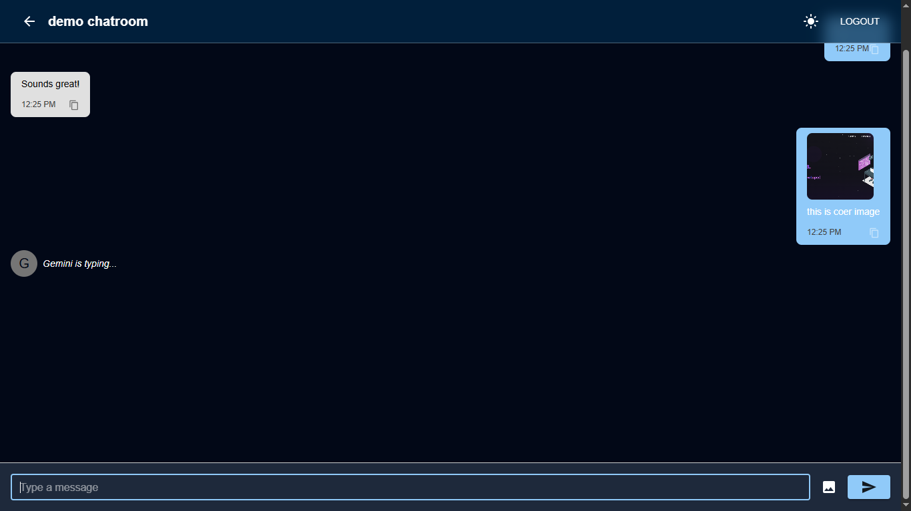

# 💬 Gemini-Style Conversational AI Chat App (Frontend Only)

[Live Demo](https://gemini-chat-app-gamma.vercel.app/)

This is a fully functional, responsive frontend application that simulates a conversational AI experience (similar to Google's Gemini). Built with **React**, **Redux**, **Material UI**, **React Hook Form + Zod**, it includes OTP-based login, chatroom management, AI-style replies, image messaging, and beautiful modern UX features.

---

## 🚀 Features

### 🔐 Authentication

- OTP-based Login/Signup
- Country code selection (via [RESTCountries API](https://restcountries.com/))
- Input validation with React Hook Form + Zod
- Simulated OTP send/verify using `setTimeout`

### 💬 Chatroom Dashboard

- View list of chatrooms
- Create/Delete chatrooms
- Toast notifications for actions
- Debounced search to filter chatrooms
- Responsive & accessible design
- Dark Mode toggle

### 🧠 Chat Interface

- Send messages as user (text or image)
- Fake AI replies with typing indicator
- Auto-scroll to latest message
- Infinite reverse scroll with dummy messages
- Copy-to-clipboard on hover
- Base64 preview for image uploads

---

## 🧱 Tech Stack

| Purpose              | Stack / Tool                         |
|----------------------|--------------------------------------|
| Framework            | React (CRA)                          |
| State Management     | Redux Toolkit                        |
| Styling              | Material UI                          |
| Form Handling        | React Hook Form + Zod                |
| Data Persistence     | localStorage                         |
| Notifications        | react-toastify                       |
| HTTP Client          | axios                                |
| Debounce/Throttle    | lodash.debounce                      |
| Routing              | React Router DOM                     |
| Image Upload         | Local base64 (no backend required)   |

---

## 📂 Folder Structure

src/
├── components/ # Reusable UI components (e.g. ChatBubble)
├── features/ # Redux slices (auth, chat, ui)
├── layouts/ # Layout wrappers 
├── pages/ # Route-level views (Login, Dashboard, Chatroom)
├── store/ # Redux store setup
├── theme/ # MUI theme customization
├── validation/ # Zod schemas
├── App.js
└── index.js

## 📸 Screenshots

### 🔐 Login Screen

### 🔑 OTP Verification Screen

### 🏠 Dashboard Interface

### ➕ Create Chatroom Interface

### 🧭 Chatroom List View

### 💬 Active Chatroom Interface

